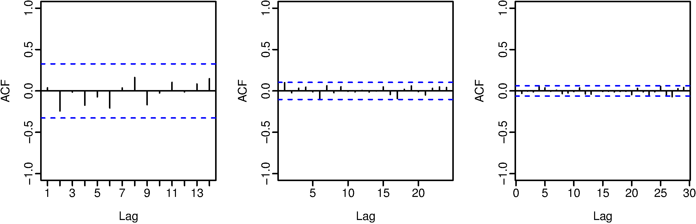

```{r setup, include=FALSE}
knitr::opts_chunk$set(echo = TRUE, comment = NA, warning = FALSE, message = FALSE,
                      fig.align = "center")
library(tidyverse)
library(scales)
# library(extrafont)
# loadfonts(device = "win", quiet = TRUE)
theme_set(theme_light())#base_family = "Calibri"))
library(pander)
```

# HA 2.1
```{r ha_2-1_load-data}
library(fma)
data("dole")
data("usdeaths")
data("bricksq")
```

## Unemployment Benefits
```{r ha_2-1_dole}
autoplot(dole) +
  labs(title = "People on unemployed benefits in Australia",
       subtitle = "January 1956 - July 1992",
       x = "Month", y = "Number receiving benefits")
```

Given the rapid growth after 1975, a transformation seems reasonable -- this plot is presented below using a base-10 logarithm:
```{r ha_2-1_dole-log}
lambda_dole <- round(BoxCox.lambda(dole), 2)
autoplot(BoxCox(dole, lambda_dole)) +
  labs(title = "People on unemployed benefits in Australia",
       subtitle = substitute("Box-Cox transformed with "*lambda*" = "*l,
                             list(l = lambda_dole)),
       x = "Month", y = "Number receiving benefits (transformed)")
```

This transformation provides greater insight into variation in the data before 1975 -- in the un-transformed plot, the data appeared to be nearly zero, but here it can be clearly seen that there is variation of non-trivial degree in this period.  The significant growth in values after 1975 is still apparent, as each horizontal line in the grid represents values more than tripling.


## Accidental Deaths
```{r ha_2-1_usdeaths}
autoplot(usdeaths) +
  labs(title = "Accidental deaths in the United States",
       subtitle = "January 1973 - December 1978",
       x = "Month", y = "Number of deaths")
```

In this case, since the magnitude of observations does not significantly change over time, a transformation is not needed.


## Brick Production
```{r ha_2-1_bricksq}
autoplot(bricksq) +
  labs(title = "Production of bricks at Portland, Australia",
       subtitle = "March 1956 - September 1994",
       x = "Quarter", y = "Millions of units produced")
```

Because of the difference in series behavior before and after 1975 (steady growth with seasonal variation followed by more stable behavior with seasonal variation), a transformation may be insightful.
```{r ha_2-1_bricksq-boxcox}
lambda_bricksq <- round(BoxCox.lambda(bricksq), 2)
autoplot(BoxCox(bricksq, lambda_bricksq)) +
  labs(title = "Production of bricks at Portland, Australia",
       subtitle = substitute("Box-Cox transformed with "*lambda*" = "*l,
                             list(l = lambda_bricksq)),
       x = "Quarter", y = "Millions of units produced (transformed)")
```

This transformation does not provide any significant differences in the way the data is displayed; it is likely that no new inferences will be developed compared to the original plot.


# HA 2.3
```{r ha_2-3_load}
data("ibmclose")
```

## Part a
The plots below show the IBM closing stock prices, change relative to the first value, and as the daily percentage change:

```{r ha_2-3_explore}
ibm_tot_diff <- ibmclose / ibmclose[1] - 1
ibm_day_diff <- ts(ibmclose[2:369] / ibmclose[1:368] - 1,
                   start = 2, end = 369, frequency = 1)

autoplot(ibmclose) +
  labs(title = "IBM stock closing prices",
       x = "Day",
       y = "Closing price") +
  scale_y_continuous(labels = dollar_format())

autoplot(ibm_tot_diff) +
  labs(title = "Change in IBM stock closing price",
       x = "Day",
       y = "Percentage change from initial value") +
  scale_y_continuous(labels = percent)

autoplot(ibm_day_diff) +
  labs(title = "Change in IBM stock closing price",
       x = "Day",
       y = "Daily percentage change") +
  scale_y_continuous(labels = percent)
```

The plots above show a steady rise in price, followed by a slight decline then a steep decline, all showing daily variation generally between -2.5% and 2.5%.  Near the end of this decline, and into the subsequent steady increase, the daily returns become increasingly volatile.  The price then decreases again slowly with a volatility lower than the period immediately preceding it, but still higher than in the initial period of 200 days.


## Part b
The data is split into a training and testing set with 300 and 69 observations, respectively:
```{r ha_2-3_split}
ibm_train <- ibmclose[1:300]
ibm_test  <- ibmclose[301:369]
```


## Part c
Three forecasts are performed on the split data:

  - Random walk with drift
  - Mean
  - Naive

```{r ha_2-3_fits}
ibm_drift <- rwf(ibm_train, 69, drift = TRUE)
ibm_mean  <- meanf(ibm_train, 69)
ibm_naive <- naive(ibm_train, 69)
```

The accuracy of this forecasts is calculated against the test data using the `accuracy` function and three measures of accuracy:

```{r ha_2-3_accuracy}
ibm_acc <- as.data.frame(rbind(
  accuracy(ibm_drift, ibm_test)["Test set", c("ME", "RMSE", "MAE", "MPE", "MAPE", "MASE")],
  accuracy(ibm_mean, ibm_test)["Test set", c("ME", "RMSE", "MAE", "MPE", "MAPE", "MASE")],
  accuracy(ibm_naive, ibm_test)["Test set", c("ME", "RMSE", "MAE", "MPE", "MAPE", "MASE")]),
  row.names = c("Drift", "Mean", "Naive"))

pander(ibm_acc)
```

By the Root Mean Squared Error, Mean Absolute Error, and Mean Absolute Percentage Error benchmarks, the random walk with drift method is most accurate.
By the Mean Absolute Scaled Error benchmark, the mean method is most accurate.
By the Mean Error and Mean Percentage error benchmarks, the naive method is most accurate.

Due to the split in which model "did best" according to various benchmarks, a determination of which measure is most appropriate (scale-dependent, percent, or absolute) to determine suitability of a forecast.  In the absence of this knowledge, a plot of the forecasts vs. the data may provide insight:

```{r ha_2-3_plot}
data_frame(Day = 1:369,
           Data = ibmclose,
           Drift = c(rep(NA, 300), ibm_drift$mean),
           Mean = c(rep(NA, 300), ibm_mean$mean),
           Naive = c(rep(NA, 300), ibm_naive$mean)) %>%
  gather(Model, Value, c(Drift, Mean, Naive)) %>% 
  ggplot(aes(Day)) +
    geom_line(aes(y = Data), col = "grey50") +
    geom_line(aes(y = Value, col = Model)) +
    geom_vline(xintercept = 300, lty = 3, col = "grey25") +
  scale_x_continuous() +
  scale_y_continuous("Closing Price", labels = dollar_format()) +
  labs(title = "IBM stock closing prices",
       subtitle = "Actual & forecast using 3 models trained on 300 days' data")
```

From this plot, it is clear that the naive model fails to capture overall trend of the observations beyond the training set, and the mean model is rather inappropriate.  The random walk with drift model best captures the data, and performed best according to 3 of 6 benchmarks utilized --- it is the most appropriate model for this data.


# HA 6.2
```{r ha_6-2_load}
data("plastics")
```


## Part a
```{r ha_6-2_a}
autoplot(plastics) +
  labs(title = "Plastics manufacturer sales",
       subtitle = "Product A",
       x = "Year",
       y = "Monthly sales (thousands)")
```

From this plot, there is a clear annual seasonality where sales rise from roughly February through roughly July or August, then fall through the end of the year through roughly the following February.  A clear increasing trend can be seen as well -- outside of the first few months of year 2, each month's sales show an increase from the same month in the prior year.


## Part b
The multiplicative decomposition, and resulting seasonal and trend indices, are presented below:
```{r ha_6-2_b}
fit_plastics <- decompose(plastics, "m")
fit_plastics[c("seasonal", "trend")]
```


## Part c
```{r ha_6-2_c}
autoplot(fit_plastics) +
  labs(title = "Decomposition of monthly plastic sales",
       subtitle = "Assuming multiplicative time series",
       x = "Year")
```

The seasonal and trend indices, as shown above and illustrated in the above graph, support the interpretation from part a -- there is an annual rising-then-falling seasonality running from February-February and a clear upward trend.


## Part d
For a multiplicative time series, the seasonally adjusted data is given by dividing the original data by the seasonal component ($y_t / S_t$)
```{r ha_6-2_d}
adj_plastics <- plastics / fit_plastics[["seasonal"]]
autoplot(adj_plastics) +
  labs(title = "Seasonally adjusted monthly plastic sales",
       subtitle = "Product A",
       x = "Year",
       y = "Monthly sales (thousands)")
```


## Part e
The 31st observation, corresponding to 2.5 years into the time window, is increased from 1303 to 2000:
```{r ha_6-2_e-out}
out_plastics <- plastics
out_plastics[31] <- 2000
```

The seasonal component and seasonally-adjusted data are recalculated, using the `seasadj` function for brevity:
```{r ha_6-2_e-plots}
fit_out_plastics <- decompose(out_plastics, "m")
gridExtra::grid.arrange(
  autoplot(fit_out_plastics$seasonal) + 
    labs(y = "Seasonal Component\n", x = NULL) +
    scale_x_continuous(labels = NULL, minor_breaks = seq(1, 6, 0.5)),
  autoplot(seasadj(fit_out_plastics)) + 
    labs(y = "Seasonally Adjusted", x = "Year"),
  top = grid::textGrob("Monthly plastic sales for Product A with outlier added in month 31"))
```

The addition of this outlier is observed in the seasonally adjusted data.  The change at $t=31$ in the seasonally adjusted data is less than the raw change to the value, indicating that some of the change is incorporated into the seasonal data.


## Part f
Performing a similar manipulation as in parts d and e, this time changing the final value of the initial time series from 1013 to 1500:

```{r ha_6-2_f}
out_end_plastics <- plastics
out_end_plastics[length(plastics)] <- 1500

fit_out_end_plastics <- decompose(out_end_plastics, "m")
gridExtra::grid.arrange(
  autoplot(fit_out_end_plastics$seasonal) + 
    labs(y = "Seasonal Component\n", x = NULL) +
    scale_x_continuous(labels = NULL, minor_breaks = seq(1, 6, 0.5)),
  autoplot(seasadj(fit_out_end_plastics)) + 
    labs(y = "Seasonally Adjusted", x = "Year"),
  top = grid::textGrob("Monthly plastic sales for Product A with outlier added in month 60"))

```

In this case, the seasonally adjusted data absorbs almost all of the change in the data, showing that the outlier at end of the period affects the seasonality of the time series less strongly than an outlier in the middle.


## Part g
A random walk with drift is performed on the seasonally adjusted plastic sales data from part d to forecast the next 12 months of seasonally adjusted data
```{r ha_6-2_g}
drift_plastics <- rwf(adj_plastics, drift = TRUE, h = 12, level = c(95))
autoplot(drift_plastics) +
  scale_x_continuous(breaks = 1:7) +
  labs(title = "Forecast of seasonally adjusted monthly plastic sales of product A",
       subtitle = "Using random walk with drift, with 95% prediction interval",
       x = "Year",
       y = "Monthly sales (thousands)") +
  theme(legend.position = "none")
```


## Part h
Reseasonalize the results to give forecasts on the original scale.
The reseasonalized results are given by multiplying the seasonal component (`figure`) of the decomposed series by multiplying the values (`mean`), and confidence bounds (`lower` and `upper`) of the forecast.  These are plotted alongside the original values below:

```{r ha_6-2_h}
reseas_plastics <- drift_plastics
reseas_plastics$x <- plastics
reseas_plastics$mean <- drift_plastics$mean * fit_plastics$figure
reseas_plastics$upper <- drift_plastics$upper * fit_plastics$figure
reseas_plastics$lower <- drift_plastics$lower * fit_plastics$figure

autoplot(reseas_plastics) +
  scale_x_continuous(breaks = 1:7) +
  labs(title = "Forecast of monthly plastic sales of Product A",
       subtitle = "Using random walk with drift, with 95% prediction interval",
       x = "Year",
       y = "Monthly sales (thousands)") +
  theme(legend.position = "none")

```


# KJ 3.1
```{r kj_3-1_load}
data("Glass", package = "mlbench")
```


## Parts a & b
The distributions of each predictor are shown below:

```{r kj_3-1_a-hist}
Glass %>%
  gather(Predictor, Value, -Type) %>%
  mutate(Predictor = forcats::as_factor(Predictor)) %>%
  ggplot(aes(x = Value)) +
  geom_histogram(bins = 15, alpha = 0.5, col = "black") +
  facet_wrap(~ Predictor, scales = "free") +
  labs(title = "Distribution of Glass predictors",
       y = "Count")
```

It can be seen that two predictors (`Ba` and `Fe`) have a very high number of zero or near-zero observations and are heavily right-skewed.  This same right-skewness is shown in predictor `K`, and to a lesser degree by predictor `Ca`.  Predictors `RI` and `NA` show a much smaller possible right-skewness.  Predictor `Mg` shows a left-skewness accompanied by a large number of zero-value observations.

It appears that there may be outliers in the extremely skewed variables.  Specifically, the strongly right-skewed `K` predictor ranges between 0 and 6, but only 3 of the 219 observations are greater than 3.  This can be further investigated using boxplots:

```{r kj_3-1_a-box}
Glass %>%
  gather(Predictor, Value, -Type) %>%
  mutate(Predictor = forcats::as_factor(Predictor)) %>%
  ggplot(aes(x = Predictor, y = Value)) +
  geom_boxplot() + coord_flip() +
  facet_wrap(~ Predictor, scales = "free") +
  ggtitle("Distribution of Glass predictors") +
  scale_x_discrete("", breaks = NULL, labels = NULL)
```

The boxplot highlights that there appear to be a number of outliers in each predictor except `Mg`.  The number of outliers by predictor is calculated, where an outlier $x$ is defined by the criteria $x < Q1(X) - 1.5 \times IQR(X)$ or $x > Q3(X) + 1.5 \times IQR(X)$ where $Q1$, $Q3$, and $IQR$ are the first quartile, third quartile, and interquartile range, respectively, of the predictor $X$.

```{r kj_3-1_a-out}
outliers_glass <- Glass %>% 
  select(-Type) %>% 
  summarise_all(funs(sum(
    . < quantile(., 0.25) - 1.5 * IQR(.) | . > quantile(., 0.75) + 1.5 * IQR(.)
    )))
```

`r pander(outliers_glass)`

This table shows that six predictors -- `RI`, `Al`, `Si`, `Ca`, `Ba`, and `Fe` -- have more than 11 outliers, corresponding to over 5% of observations.

The correlation between the predictors are shown in the plot below:

```{r kj_3-1_a-cor}
Glass %>%
  GGally::ggcorr(label = TRUE, label_round = 2) +
  labs(title = "Correlation of glass predictors") +
  theme(legend.position = "none")
```


From this visualization, it can be seen that there is a high positive correlation (0.81) between `RI` and `Ca`; the strongest positive correlation not involving the `RI` predictor is 0.48 between `Al` and `Ba`.  The strongest negative correlation (-0.54) exists between `RI` and `Si`, followed by -0.49 between `Ba` and `Mg`.  There are five predictor pairs with correlation of absolute value less than 0.05.


## Part c
For the skewed predictors identified above, a Box-Cox transformation may improve the classification model by reducing or removing the skew.  For the six predictors with high concentrations of outliers, a spatial sign transformation may be useful if the model is sensitive to outliers.


# KJ 3.2
```{r kj_3-2_load}
data("Soybean", package = "mlbench")
```


## Part a
The following predictors meet the degeneracy criteria set forth in the text:

  - Fraction of unique values over sample size (`Unique_Ratio`) under 10%
  - Ratio of the most frequent value to second-most frequent (`Freq_Ratio`) over 20

```{r kj_3-2_a}
degen_soybean <- Soybean %>% 
  # convert predictors to tidy format
  select(-Class, -date) %>% 
  gather(Predictor, Value) %>% 
  # only consider complete cases
  drop_na() %>%
  group_by(Predictor, Value) %>% 
  # get ratio of most prevalent to second-most prevalent by variable
  summarise(n = n()) %>% 
  mutate(Freq_Ratio = max(n) / sort(n, decreasing = TRUE)[2]) %>% 
  # get fraction of unique values over number of observations
  group_by(Predictor, Freq_Ratio) %>% 
  summarise(Unique_Ratio = length(unique(Value)) / nrow(Soybean)) %>% 
  # filter for degenerate predictors
  ungroup() %>% 
  filter(Freq_Ratio > 20, Unique_Ratio < 0.10)
```

`r pander(degen_soybean)`


## Part b
The predictors are shown below by the portion of observations with missing data:

```{r kj_3-2_b-predictor}
missing_predictor <- Soybean %>% 
  # convert to tidy format
  select(-Class) %>% 
  gather(Predictor, Value) %>% 
  # get number missing by predictor
  group_by(Predictor) %>% 
  summarize(Missing = sum(is.na(Value))) %>% 
  # divide by total observations
  mutate(Missing = Missing / nrow(Soybean)) %>% 
  arrange(desc(Missing))
```

`r pander(missing_predictor)`

The predictors `hail`, `lodging`, `seed.tmt`, and `sever` have the highest proportion of missing values (17.72%), closely followed by `germ` (16.4%).  The `leaves` predictor has no missing values, while `area.dam` and `date` have roughly 0.15% missing, corresponding to a single missing value.

Similarly, the proportion of missing predictor values with missing data is shown below by class:

```{r kj_3-2_b-class}
missing_class <- Soybean %>% 
  # convert to tidy format
  gather(Predictor, Value, -Class) %>% 
  # get number missing by class
  group_by(Class) %>% 
  summarize(Missing = sum(is.na(Value))) %>% 
  # divide by observations * predictors
  mutate(Missing = Missing / (nrow(Soybean) * 35)) %>% 
  arrange(desc(Missing))
```

`r pander(missing_class)`

The *phytophthora-rot* shows over 5% missing values; the *2-4-d-injury* and *cyst-nematode* show between 1-2% missing values; the *diaporthe-pod-&-stem-blight* and *herbicide-injury* show under 1% missing values; the remaining 14 classes show zero missing values.  Note that these percentages are an indication of the number of observations of each variable missing, i.e. the number of missing data points rather than observations that contain missing data points.


## Part c
As outlined in Part a, the variables *leaf.mild*, *mycelium*, and *sclerotia* are degenerate -- these variables should be removed.  To investigate the appropriate approach for additional missing variables, the patterns of missing values across predictors and classes are investigated:
```{r kj_3-2_c}
# get degenerative predictors
predictors_degen <- degen_soybean %>% pull(Predictor)

# get classes with missing values
classes_missing <- missing_class %>% filter(Missing > 0) %>%
  pull(Class) %>% as.character()

# calculate missing values by predictor & class, then plot
Soybean %>% 
  # convert to tidy format, select missing classes, exclude degen predictors
  gather(Predictor, Value, -Class) %>% 
  filter(Class %in% classes_missing,
         !Predictor %in% predictors_degen) %>% 
  # get number missing by predictor & class
  group_by(Predictor, Class) %>% 
  summarize(n = n(), Missing = sum(is.na(Value))) %>% 
  # divide by observations * predictors
  mutate(Missing = Missing / n) %>% 
  ungroup() %>%
  # plot tiled results (heatmap)
  ggplot(aes(x = Predictor, y = Class, fill = Missing)) +
  geom_tile() +
  # tweak appearance
  scale_y_discrete(limits = rev(classes_missing)) +
  scale_fill_gradient(name = "% of Values Missing", low = "white", high = "black") +
  theme(axis.text.x = element_text(angle = 90, hjust = 1),
        legend.position = "bottom") +
  ggtitle("Missing values by class & predictor")
```

The classes *2-4-d-injury*, *cyst-nematode*, and *herbicide-injury* show nearly 100% missing values across all predictors.  Imputation of values for these classes will likely not be helpful since so many of the observations are missing; as such, cases associated with these three classes should be removed from the dataset.  Given the more moderate nature of the missing data patterns for the *phytophthora-rot* and *diaporthe-pod-&-stem-blight* classes, imputation for the missing values may be more informative and should be performed.


# HA 7.1
```{r ha_7-1_load}
data("books")
```

## Part a
```{r ha_7-1_a}
autoplot(books) +
  labs(title = "Daily sales of paperback and hardcover books",
       x = "Day", y = "Number of books sold") +
  scale_color_discrete("Book format") +
  theme(legend.position = "bottom")
```

The data for both book formats show an upward trend; a slight cyclical behavior is also apparent, though it does not appear to be seasonal.


## Part b
```{r ha_7-1_paperback-b-iterate}
# separate paperback series
paperback <- books[, "Paperback"]
# create containers for results
alpha_paperback <- numeric()
sse_paperback <- numeric()
# loop through possible values of alpha in increments of 0.01
for (alpha in seq(0, 1, 0.01)) {
  # get fit and associated SSE; save to list
  fit <- ses(paperback, initial = "simple", alpha = alpha)
  SSE <- sum((paperback - fit$fitted)^2)
  # store alpha and SSE values
  alpha_paperback <- c(alpha_paperback, alpha)
  sse_paperback <- c(sse_paperback, SSE)
}
# combine into data frame and plot
fits_paperback <- data_frame(alpha = alpha_paperback, SSE = sse_paperback)
ggplot(fits_paperback, aes(x = alpha, y = SSE)) +
  geom_line() +
  labs(title = "SSE of fitted exponential smoothed values of paperback book sales",
       subtitle = expression("With varying "*alpha*" and \"simple\" initial value"),
       x = expression(alpha))
```


It is clear from the plot that the value of $\alpha$ affects the accuracy of forecasts.  From the plot, it appears that the best value of $\alpha$ (corresponding to the lowest SSE) is between 0.125 and 0.25.  This can be calculated to show that the SSE is optimized with $\alpha = `r fits_paperback %>% slice(which.min(SSE)) %>% pull(alpha)`$:
```{r ha_7-1_paperback-b-best}
(paperback_loop_alpha <- fits_paperback %>% slice(which.min(SSE)))
```


## Parts c & d
Using `ses` without specifying an $\alpha$ parameter returns a value similar to that observed above:
```{r ha_7-1_paperback-c}
paperback_simple <- ses(paperback, initial = "simple", h = 4)
(paperback_simple_alpha <- paperback_simple$model$par["alpha"])
```

Performing this again with `initial="optimal"` yields a result that is a fair deal off:
```{r ha_7-1_paperback-d}
paperback_opt <- ses(paperback, initial = "optimal", h = 4)
(paperback_opt_alpha <- paperback_opt$model$par["alpha"])
```

A comparison of the $\alpha$ values and associated SSEs is presented below:
```{r ha_7-1_paperback-d-compare}
emphasize.strong.cols(1)
data_frame(Method = c("Loop", "SES simple", "SES optimal"),
           alpha = c(paperback_loop_alpha$alpha,
                     paperback_simple_alpha,
                     paperback_opt_alpha),
           SSE = c(paperback_loop_alpha$SSE,
                   sum((paperback_simple$fitted - paperback)^2),
                   sum((paperback_opt$fitted - paperback)^2))) %>% 
  pander()
```

It can be seen that although the values of $\alpha$ differ between methods, the SSE does not vary tremendously.


## Hardcover
```{r ha_7-1_hardcover-calc}
# separate paperback series
hardcover <- books[, "Hardcover"]

## part b -- loop approach
# create containers for results
alpha_hardcover <- numeric()
sse_hardcover <- numeric()
# loop through possible values of alpha in increments of 0.01
for (alpha in seq(0, 1, 0.01)) {
  # get fit and associated SSE; save to list
  fit <- ses(hardcover, initial = "simple", alpha = alpha)
  SSE <- sum((hardcover - fit$fitted)^2)
  # store alpha and SSE values
  alpha_hardcover <- c(alpha_hardcover, alpha)
  sse_hardcover <- c(sse_hardcover, SSE)
}
# combine into data frame and plot
fits_hardcover <- data_frame(alpha = alpha_hardcover, SSE = sse_hardcover)
ggplot(fits_hardcover, aes(x = alpha, y = SSE)) +
  geom_line() +
  labs(title = "SSE of fitted exponential smoothed values of hardcover book sales",
       subtitle = expression("With varying "*alpha*" and \"simple\" initial value"),
       x = expression(alpha))
# get best value
hardcover_loop_alpha <- fits_hardcover %>% slice(which.min(SSE))

## parts c & d -- ses selection
# with initial = "simple"
hardcover_simple <- ses(hardcover, initial = "simple", h = 4)
hardcover_simple_alpha <- hardcover_simple$model$par["alpha"]
# with initial = "optimal"
hardcover_opt <- ses(hardcover, initial = "optimal", h = 4)
hardcover_opt_alpha <- hardcover_opt$model$par["alpha"]
```


The resulting values of $\alpha$ and associated SSE are shown below:
```{r ha_7-1_hardcover-compare, echo=FALSE}
emphasize.strong.cols(1)
data_frame(Method = c("Loop", "SES simple", "SES optimal"),
           alpha = c(hardcover_loop_alpha$alpha,
                     hardcover_simple_alpha,
                     hardcover_opt_alpha),
           SSE = c(hardcover_loop_alpha$SSE,
                   sum((hardcover_simple$fitted - hardcover)^2),
                   sum((hardcover_opt$fitted - hardcover)^2))) %>% 
  pander()
```

As for the paperback series, the value of $\alpha$ with `initial="simple"` is very close to the value derived by iterating through a loop, and the value with `initial="optimal"` is a bit different than the other two, though to a lesser degree in this case.  The SSE values vary even less for the hardcover series, and are nearly identical for the loop & SES simple methods.


# HA 7.2
```{r ha_7-2_forecast}
# get linear holt fits for each series with 4-day forecast & default arguments
paperback_holt <- holt(paperback, h = 4)
hardcover_holt <- holt(hardcover, h = 4)
```

## Part a
The SSE measures for the above forecasts can be compared to the exponential smoothing forecasts prepared in part d of question 7.1 by squaring and summing the residuals:
```{r ha_7-2_a-paperback}
# get SSE values for paperback forecasts
sse_opt_paperback <- sum(paperback_opt$residuals^2)
sse_holt_paperback <- sum(paperback_holt$residuals^2)

# get SSE values for hardcover forecasts
sse_opt_hardcover <- sum(hardcover_opt$residuals^2)
sse_holt_hardcover <- sum(hardcover_holt$residuals^2)

# gather results into matrix
holt_v_opt <- matrix(c(sse_opt_paperback, sse_holt_paperback,
                       sse_opt_hardcover, sse_holt_hardcover),
                     nrow = 2, byrow = TRUE,
                     dimnames = list(c("Paperback", "Hardcover"), c("SES", "Holt")))
```

`r pander(holt_v_opt, caption = "Comparison of SSE measure for SES & Holt methods")`

The table clearly shows that Holt's method yields a much slower error in the forecast.  This method is more appropriate for these two data series, as it is able to capture the upwards trend noted in part a of the previous question.


## Part b
The two forecasts for the paperback series are presented below:

```{r ha_7-2_b-paperback}
gridExtra::grid.arrange(
  autoplot(paperback_opt) +
    labs(title = "Simple exponential smoothing forecast of paperback sales",
         subtitle = expression("Using optimal value of "*alpha),
         x = "Day", y = NULL) +
    theme(legend.position = "none"),
  autoplot(paperback_holt) +
    labs(title = "Holt's method forecast of paperback sales",
         subtitle = "Using linear trend",
         x = "Day", y = NULL) +
    theme(legend.position = "none"),
  ncol = 1)
```

The two forecasts for the hardcover series are presented below:

```{r ha_7-2_b-hardcover}
gridExtra::grid.arrange(
  autoplot(hardcover_opt) +
    labs(title = "Simple exponential smoothing forecast of hardcover sales",
         subtitle = expression("Using optimal value of "*alpha),
         x = "Day", y = NULL) +
    theme(legend.position = "none"),
  autoplot(hardcover_holt) +
    labs(title = "Holt's method forecast of hardcover sales",
         subtitle = "Using linear trend",
         x = "Day", y = NULL) +
    theme(legend.position = "none"),
  ncol = 1)
```

For both series, the Holt's method linear forecast appears to better capture the upward trend in the data, as discussed in part b, while the simple exponential smoothing forecast fails to do so.


## Part c
The 95% prediction interval can be generated using the equation $\hat{y}_t \pm 1.96 \times \sqrt{\hat{\sigma^2}}$ for each of the four forecasts:
```{r ha_7-2_c}
# manually calculate prediction intervals
paper_opt_pi_man <- c(paperback_opt$mean[1] - 1.96 * sqrt(paperback_opt$model$sigma2),
                      paperback_opt$mean[1] + 1.96 * sqrt(paperback_opt$model$sigma2))
paper_holt_pi_man <- c(paperback_holt$mean[1] - 1.96 * sqrt(paperback_holt$model$sigma2),
                       paperback_holt$mean[1] + 1.96 * sqrt(paperback_holt$model$sigma2))
hard_opt_pi_man <- c(hardcover_opt$mean[1] - 1.96 * sqrt(hardcover_opt$model$sigma2),
                     hardcover_opt$mean[1] + 1.96 * sqrt(hardcover_opt$model$sigma2))
hard_holt_pi_man <- c(hardcover_holt$mean[1] - 1.96 * sqrt(hardcover_holt$model$sigma2),
                      hardcover_holt$mean[1] + 1.96 * sqrt(hardcover_holt$model$sigma2))

# extract prediction intervals calculated by R
paper_opt_pi_r <- unname(c(paperback_opt$lower[1, "95%"], paperback_opt$upper[1, "95%"]))
paper_holt_pi_r <- unname(c(paperback_holt$lower[1, "95%"], paperback_holt$upper[1, "95%"]))
hard_opt_pi_r <- unname(c(hardcover_opt$lower[1, "95%"], hardcover_opt$upper[1, "95%"]))
hard_holt_pi_r <- unname(c(hardcover_holt$lower[1, "95%"], hardcover_holt$upper[1, "95%"]))

# collect into matrix
pi_matrix <- matrix(c(paper_opt_pi_man, paper_opt_pi_r,
                      paper_holt_pi_man, paper_holt_pi_r,
                      hard_opt_pi_man, hard_opt_pi_r,
                      hard_holt_pi_man, hard_holt_pi_r),
                    ncol = 4, byrow = TRUE,
                    dimnames = list(c("Paperback SES", "Paperback Holt",
                                      "Hardcover SES", "Hardcover Holt"),
                                    c("Manual Lower", "Manual Upper",
                                      "R Lower", "R Upper")))
```

`r pander(pi_matrix)`

As seen in the table above, the manually-calculated prediction intervals are equivalent to those calculated by R.


# HA 8.1


The three ACF figures show different critical values indicating autocorrelation, as well as a differing number of lags along the x axis.  Both of these differences are due to the number of observations in the samples -- the critical values scale by a factor of $T^{-1/2}$.

All three figures indicate that the associated data are white noise, as all vertical lines fall within the critical values indicated by the dotted blue lines.


# HA 8.2
Explain how each plot shows the series is non-stationary and should be differenced.

The plot of IBM closing stock prices, as well as the ACF and PACF of the series are presented below:
```{r ha_8-2}
ggtsdisplay(ibmclose, main = "IBM stock closing prices", points = FALSE,
            xlab = "Day", ylab = "Closing price")
```

The plot of the time series shows some clear trends -- first upwards, then downwards, then upwards again followed by a decline near the end; these trends make the series non-stationary.  The ACF plot shows all values $r_k$ well outside the bounds of the critical values, indicating there is a high autoregressive nature of the series.  The PACF shows $r_1 \approx 1$ with all other $r_k$ below the critical value; this is indicative of a random walk and therefore non-stationary.


# HA 8.6
```{r ha_8-6_load}
data("wmurders", package = "fpp")
```


## Parts a-c
The time series is plotted below:
```{r ha_8-6_a-plot}
autoplot(wmurders) +
  labs(title = "Number of women murdered in United States", subtitle = "1950-2004",
       x = "Year", y = "Murders per 100,000 population")
```

The variance of the series appears to increase with the level of the time series -- as such, the series will be log-transformed.  The series is clearly non-stationary, as it displays trend behavior.  There is no apparent seasonality, so a simple difference is taken.

The transformed, differenced series is plotted below, alongside ACF & PACF figures:
```{r ha_8-6_a-log}
ggtsdisplay(diff(log(wmurders)),
            main = "Differenced logarithm of number of women murdered in United States",
            xlab = "Year", points = FALSE)
```

This series appears sufficiently stationary.  There are spikes at $k=2$ in both the ACF and PACF figures, suggesting that a AR(2) or MA(2) model is appropriate for the differenced data.  The former is selected, yielding an ARIMA(2, 1, 0) model.  There does not appear to be any drift in the original dataset, so a constant is not included in the model.  This model can be written in backshift notation as
$$\left(1- \phi_1B - \phi_2B^2\right)\left(1-B\right) y_t = e_t$$


## Part d
A log transformation is equivalent to a Box-Cox transformation with $\lambda = 0$, so this parameter is fed into the `Arima` function:
```{r ha_8-6_d-fit}
murder_fit <- Arima(wmurders, order = c(2, 1, 0), lambda = 0)
```

The residuals of this fit are explored below:
```{r ha_8-6_d-resid}
murder_resid <- residuals(murder_fit)
ggtsdisplay(murder_resid, plot.type = "histogram", points = FALSE,
            main = "Residuals for ARIMA(2,1,0) fit of number of women murdered",
            xlab = "Year", ylab = "Residual")
```

From the top plot, it can be seen that the residuals have a near-zero mean, and the variance in the residuals is near-constant; the ACF plot shows there is no significant correlation between residuals; the histogram and accompanying density plot appear to approximate a normal distribution.  From these results, the model appears satisfactory -- this is confirmed using a portmanteau test (using $K = p + q = 2$ and a lag of 15 to correspond to the ACF plot), which returns a result $>> 0.05$:
```{r ha_8-6_d-port}
Box.test(murder_resid, type = "L", fitdf = 2, lag = 15)
```


## Parts e & f
```{r ha_8-6_e-fcast}
murder_fcast <- forecast(murder_fit, 3)
autoplot(murder_fcast) + theme(legend.position = "none")
```

The forecast values, rounded to 3 decimal places, are given below:
`r pander(round(murder_fcast$mean, 3))`


### Manual Calculation
Each of the forecasts are checked manually below:
```{r ha_8-6_e-manual, echo=FALSE}
# extract coefficients for display
phi1 <- coefficients(murder_fit)[1]
phi2 <- coefficients(murder_fit)[2]
B1 <- 1 + phi1
B2 <- phi2 - phi1
B3 <- -phi2
# extract tail for display
y_lag <- rev(tail(log(wmurders), 3))
# create estimates
y_log_1 <- B1 * y_lag[1] + B2 * y_lag[2] + B3 * y_lag[3]
y_hat_1 <- exp(y_log_1)
y_log_2 <- B1 * y_log_1 + B2 * y_lag[1] + B3 * y_lag[2]
y_hat_2 <- exp(y_log_2)
y_log_3 <- B1 * y_log_2 + B2 * y_log_1 + B3 * y_lag[1]
y_hat_3 <- exp(y_log_3)
```

The equation from part c can be expanded to be rewritten as
$$[1 - (1 + \phi_1)B + (\phi_1 - \phi_2)B^2 + \phi_2B^3]y_t = e_t$$
The backshift operator can be applied and the equation rearranged to give
$$y_t = (1 + \phi_1)y_{t-1} + (\phi_2 - \phi_1)y_{t-2} - \phi_2 y_{t-3} + e_t$$
This can now be rearranged to isolate for $y_t$ and used to forecast for the next 3 periods, using the log-transformed series and $\phi_1 = `r round(phi1, 3)`$ and $\phi_2 = `r round(phi2, 3)`$:

$$\begin{aligned}
y_{T+1} &= (1 + \phi_1)y_{T} + (\phi_2 - \phi_1)y_{T-1} - \phi_2 y_{T-2} + e_{T+1} \\
         &= (`r round(B1, 3)`) `r round(y_lag[1], 3)` -
            (`r round(B2, 3)`) `r round(y_lag[2], 3)` +
            (`r round(B3, 3)`) `r round(y_lag[3], 3)` + 0 \\
         &= `r round(y_log_1, 3)`
\end{aligned}$$

To transfer back to the original scale, $$\hat{y}_{T+1|T} = e^{`r round(y_log_1, 3)`} \approx `r round(y_hat_1, 3)`$$

For the next prediction,
$$\begin{aligned}
y_{T+2} &= (1 + \phi_1)y_{T+1} + (\phi_2 - \phi_1)y_{T} - \phi_2 y_{T-1} + e_{T+2} \\
         &= (`r round(B1, 3)`) `r round(y_log_1, 3)` -
            (`r round(B2, 3)`) `r round(y_lag[1], 3)` +
            (`r round(B3, 3)`) `r round(y_lag[2], 3)` + 0 \\
         &= `r round(y_log_2, 3)`
\end{aligned}$$

$$\hat{y}_{T+2|T+1} = e^{`r round(y_log_2, 3)`} \approx `r round(y_hat_2, 3)`$$

Finally,
$$\begin{aligned}
y_{T+3} &= (1 + \phi_1)y_{T+2} + (\phi_2 - \phi_1)y_{T+1} - \phi_2 y_{T} + e_{T+3} \\
         &= (`r round(B1, 3)`) `r round(y_log_2, 3)` -
            (`r round(B2, 3)`) `r round(y_log_1, 3)` +
            (`r round(B3, 3)`) `r round(y_lag[1], 3)` + 0 \\
         &= `r round(y_log_3, 3)`
\end{aligned}$$

$$\hat{y}_{T+3|T+2} = e^{`r round(y_log_3, 3)`} \approx `r round(y_hat_3, 3)`$$

It can be seen that the derived forecasts match those generated by `forecast`.


## Part g
An `auto.arima` fit is created for the data, setting $\lambda = 0$ to log-transform the data setting the `seasonal` option to false:
```{r ha_8-6_g-fit}
(murder_auto <- auto.arima(wmurders, lambda = 0, seasonal = FALSE))
```

The `auto.arima` model fit is an ARIMA(1, 2, 1) consistently with modifying function arguments.  This obviously differs from the ARIMA(2, 1, 0) used in this problem.

The ARIMA(2, 1, 0) model shows a better $AIC_c$ than the ARIMA(1, 2, 1), but, per the text, "when models are compared using AICc values, it is important that all models have the same orders of differencing."  Since the model selected manually has $d=1$ and the `auto.arima` model has $d=2$, this comparison is not informative.

To compare the validity of the forecasts of two ARIMA models despite different model characteristics, a test set is used to calculate the RMSE on the tail portion of the data.  The `getrmse` function from the text is used for this:

```{r ha_8-6_g-rmse}
# definte RMSE function
getrmse <- function(x, h, ...) {
  train.end <- time(x)[length(x) - h]
  test.start <- time(x)[length(x) - h + 1]
  train <- window(x, end = train.end)
  test <- window(x, start = test.start)
  fit <- Arima(train, ...)
  fc <- forecast(fit, h = h)
  accuracy(fc, test)[2, "RMSE"]
}

# get RMSEs using test set of last 5 years
RMSEs <- c(getrmse(wmurders, 3, order = c(2, 1, 0), lambda = 0),
           getrmse(wmurders, 3, order = c(1, 2, 1), lambda = 0))
names(RMSEs) <- c("manually selected", "auto.arima selected")
```

`r pander(RMSEs)`

The table above shows that the auto.arima selected model performs better on the test set, but inspection of a forecast generated by the model reveals a potential issue:

```{r ha_8-6_g-plot}
autoplot(forecast(murder_auto, 3)) + theme(legend.position = "none")
```

From the plot above, it can be seen that the ARIMA(1, 2, 1) model extends the drop in rate in recent years continuously.  This is probably less realistic than the ARIMA(2, 1, 0) model's prediction of a steadying of the rate.  It also may explain the higher RMSE of this model against the test set, since the years of the test set illustrate a downward trend.  For the sake of practicality and extensibility, the ARIMA(2, 1, 0) model should be used, even if it means a slight tradeoff in accuracy.


# HA 8.8
```{r ha_8-8_load}
data("usmelec", package = "fpp")
```

## Part a
The raw data and the moving average are presented together in the plot below:
```{r ha_8-8_a}
data_frame(Month = time(usmelec),
           TWh = as.numeric(usmelec),
           MA = ma(usmelec, order = 12)) %>% 
  ggplot(aes(x = Month)) +
  geom_line(aes(y = TWh, col = "Data")) +
  geom_line(aes(y = MA, col = "MA"), lwd = 1.25) +
  scale_color_manual(NULL, breaks = c("Data", "MA"), values = c("black", "#F8766D")) +
  theme(legend.position = c(0.85, 0.15)) +
  ggtitle(label = "Net electricity generation in US", subtitle = "1985-1996")
```

It is clear from the moving average in the plot that electricity generation has a stable upward trend.


## Parts b & c
The variation in the data appears to increase; therefore a transformation is investigated:
```{r ha_8-8_b}
elec_lambda <- BoxCox.lambda(usmelec)
elec_trans <- BoxCox(usmelec, elec_lambda)
```

The data is transformed using the recommended pattern of $\lambda = `r round(elec_lambda, 3)`$.  As identified above, the data is not stationary -- this will not be fixed by the Box-Cox transformation, so differencing is required.  As stated in the text, the series shows two annual peaks; therefore a lag-6 differencing is attempted first:
```{r ha_8-8_c-6}
elec_diff <- diff(elec_trans, 6)
ggtsdisplay(elec_diff, points = FALSE,
            main = "Differenced (lag-6) Box-Cox transformed US electricity generation",
            xlab = "Month")
```

There is still apparent seasonality present in this plot, and the sinusoidal behavior of the ACF plot clearly indicates a lack of stationary behavior; as such, lag-12 differencing is used and checked for stationarity:
```{r ha_8-8_c-12}
elec_diff <- diff(elec_trans, 12)
ggtsdisplay(elec_diff, points = FALSE,
            main = "Differenced (lag-12) Box-Cox transformed US electricity generation",
            xlab = "Month")
```

This lag has successfully eliminated the seasonality and created a stationary time series (as seen in the decaying behavior of the ACF plot).  This makes sense, as the two spikes observed in a given year are not of equal magnitude.


## Part d
The PACF plot above shows a large spike at $k=1$ followed by much lower values -- this suggests $Q = 1$ with $D = 1$ to reflect the lag-12 differencing above.  The ACF shows a large spike at $k=1$ followed by slightly smaller spikes at $k=2$ and $k=3$, after which the values decline.  This suggests fifteen possible models: ARIMA(p, 0, q)(0, 1, 1) for $p, q \in [0, 1, 2, 3]$ excluding the case where $p, q = 0$

The models are calculated and their AIC values returned:
```{r ha_8-8_d-aic}
# define function to create models & return AIC values
elec_aic <- function(p, d, q, P, D, Q) {
  # create model with Box-Cox and specified ARIMA parameters; extract AIC
  AIC(Arima(usmelec, order = c(p, d, q), seasonal = c(P, D, Q), lambda = elec_lambda))
}
# create possible combinations of p & q
elec_pq <- expand.grid(p = 0:3, q = 0:3) %>% filter(p > 0 | q > 0)
# calculate AIC for ARIMA(p, 0, q)(0, 1, 1)
elec_pq <- elec_pq %>% mutate(aic = pmap_dbl(list(p, 0, q, 0, 1, 1), elec_aic))
# return best AIC
elec_pq %>% slice(which.min(aic))
```

The lowest AIC returned was for $p=2, q = 1$, so the best model is ARIMA(2, 0, 1)(0, 1, 1).  This model is used going forward:
```{r ha_8-8_d-fit}
elec_fit <- Arima(usmelec, order = c(2, 0, 1), seasonal = c(0, 1, 1), lambda = elec_lambda)
```


## Part e
The parameters of the model, returned by `elec_fit$coef`, are as follows:

  - $\phi_1 = `r round(elec_fit[["coef"]][1], 4)`$
  - $\phi_2 = `r round(elec_fit[["coef"]][2], 4)`$
  - $\theta_1 = `r round(elec_fit[["coef"]][3], 4)`$
  - $Theta_1 = `r round(elec_fit[["coef"]][4], 4)`$

A Ljung-Box test returns a p-value > 0.05, suggesting that the residuals may be white noise:
```{r ha_8-8_e-box}
Box.test(resid(elec_fit), type = "L", fitdf = 4, lag = 5)
```

The residuals are further explored via diagnostic plotting:
```{r ha_8-8_e-resid}
ggtsdisplay(resid(elec_fit), points = FALSE, plot.type = "histogram",
            main = "Residuals for ARIMA(2,0,1)(0,1,1) fit of electric generation",
            xlab = "Month", ylab = "Residual")
```

The residuals appear to be approximately normally distributed with a mean around zero.  They do not appear to be autocorrelated, but there is a large spike at $k = 15$.


## Parts f & g
The forecast for the next 15 years (180 months) is created and plotted below:
```{r ha_8-8_f-fcast}
elec_fcast <- forecast(elec_fit, 180, level = 95)
autoplot(elec_fcast) + theme(legend.position = "none") +
  labs(title = "Forecasted US electricity generation, Nov 2010 - Oct 2025",
       subtitle = "Using ARIMA(2,0,1)(0,1,1) model",
       x = "Month", y = "TWh")
```

The forecast shows continued steady growth with the same seasonality observed in the data, with the 95% prediction interval showing the possibility of expanded, possibly exponential, growth or a slight decline.

The link provided in the text only provides data though June 2013; however, its original source, the [US EIA](https://www.eia.gov/totalenergy/data/monthly/#electricity) provides data through present day, accessed via Topic 7.2a.  This data is read in and used to test for accuracy.

```{r ha_8-8_f-accuracy}
# read in data from EIA website
elec_new <- read_csv("https://www.eia.gov/totalenergy/data/browser/csv.php?tbl=T07.02A")
# extract relevant data
elec_new <- elec_new %>% 
  # filter for dates after usmelec & generation by all fuel sources (Column_Order 13)
  # also remove annual totals (denoted by month 13)
  filter(YYYYMM > 201010, Column_Order == 13, substr(YYYYMM, 5, 6) != "13") %>% 
  # select needed columns: MSN & Desciprtion are redundant to Column_Name; units identical
  select(YYYYMM, Value) %>% 
  # convert from millions of kWh (GWh) to billions of kWh (TWh)
  mutate(Value = Value / 1000)
# convert to timeseries
elec_new <- ts(elec_new$Value, start = c(2010, 11), frequency = 12)
```

The accuracy of the forecast can now be compared to the actuals (through June 2016) using the `accuracy` function:

`r pander(t(accuracy(elec_fcast, elec_new)))`

The accuracy of these forecasts through the period containing available data is fairly good, with an RMSE on the test set of roughly 16 and an MAPE of 3.98%.  When plotted, the quality of the forecast is also apparent:

```{r ha_8-8_f-plot}
# create data frame
data_frame(Month = time(elec_new),
           Actual = elec_new,
           Forecast = window(elec_fcast$mean, end = max(time(elec_new)))) %>% 
  ggplot(aes(x = Month)) +
  geom_line(aes(y = Forecast, col = "Forecast", lty = "Forecast"), lwd = 1) +
  geom_line(aes(y = Actual, col = "Actual", lty = "Actual")) +
  scale_color_discrete("") + scale_linetype_discrete("") +
  theme(legend.position = c(0, -0.15), legend.direction = "horizontal",
        legend.justification = c(0, 0.5), legend.background = element_blank()) +
  labs(title = "Actual and forecast US energy generation, Nov 2010 - Jun 2017",
       subtitle = "Using ARIMA(2,0,1)(0,1,1) model", y = "TWh",
       caption = "Source: EIA Monthly Energy Review, September 2017, Topic 7.2a")
```

While the forecast is fairly accurate in the time window utilized here, it can be seen that it is becoming less accurate with time.  It is likely that the forecast should not be used beyond the roughly 6-year horizon shown in the plot above, and almost definitely not to the full 15-year window generated here.  At this duration, the forecast may be informative, but will likely not be accurate enough to be usable.


<!--
## KJ 6.3
-->
